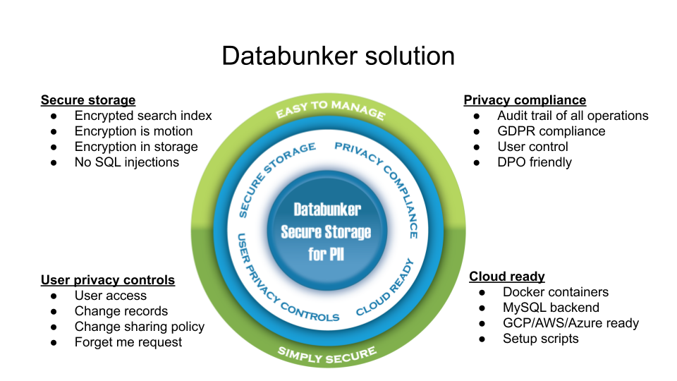
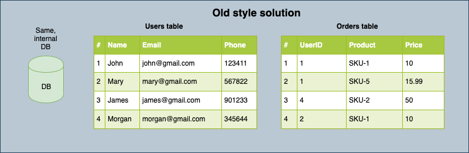
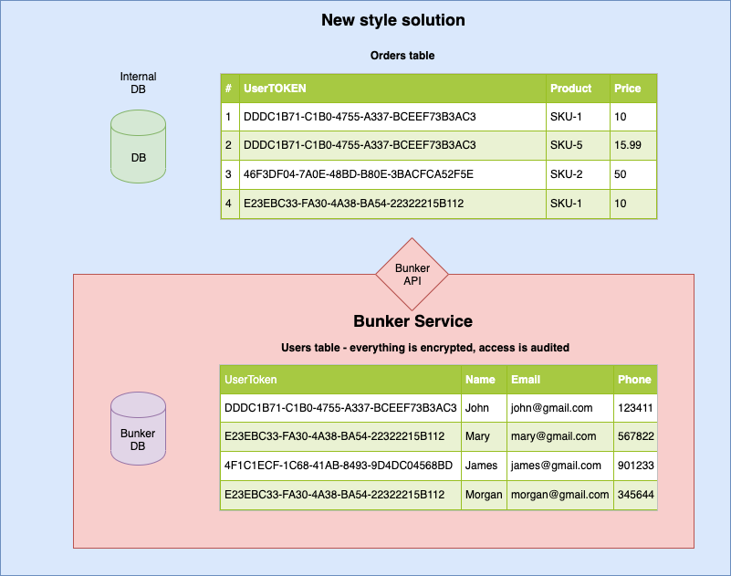
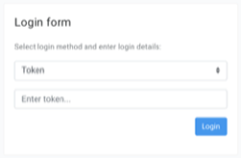
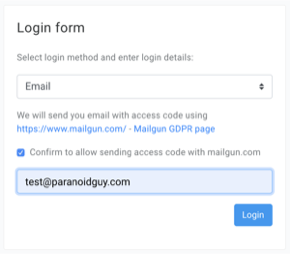
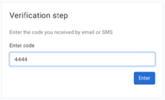
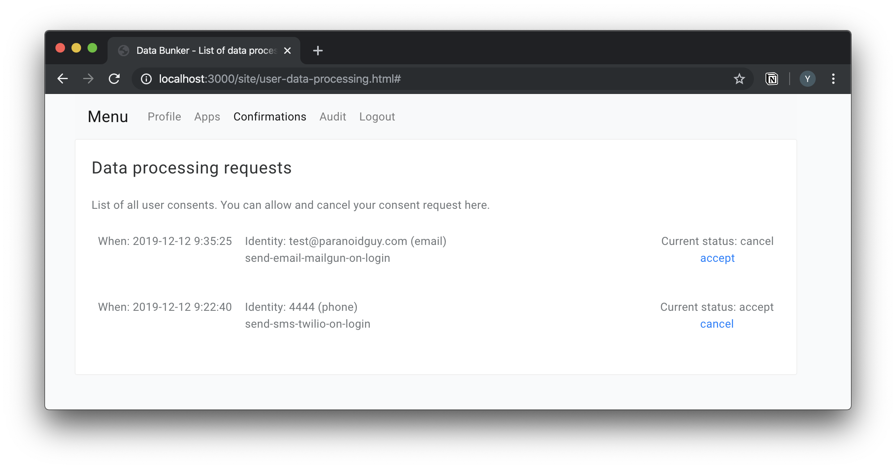
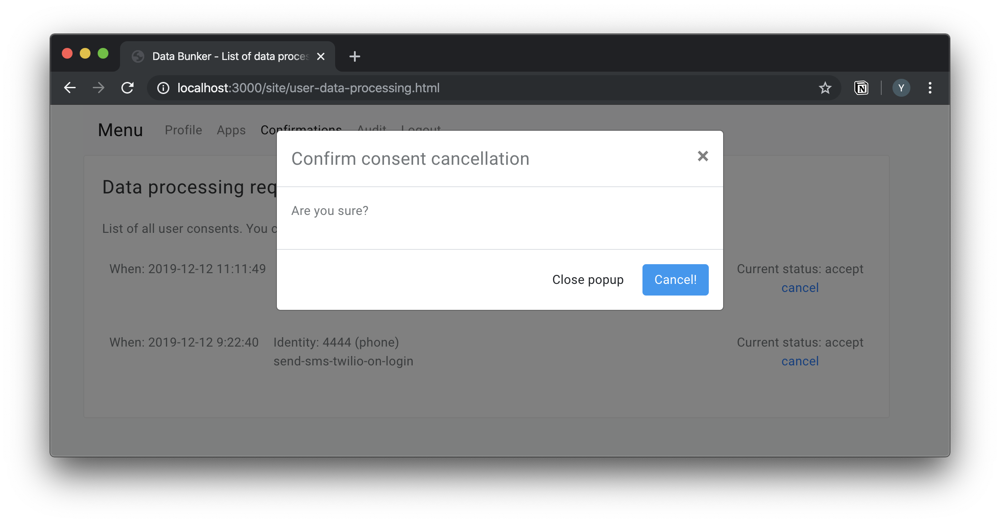
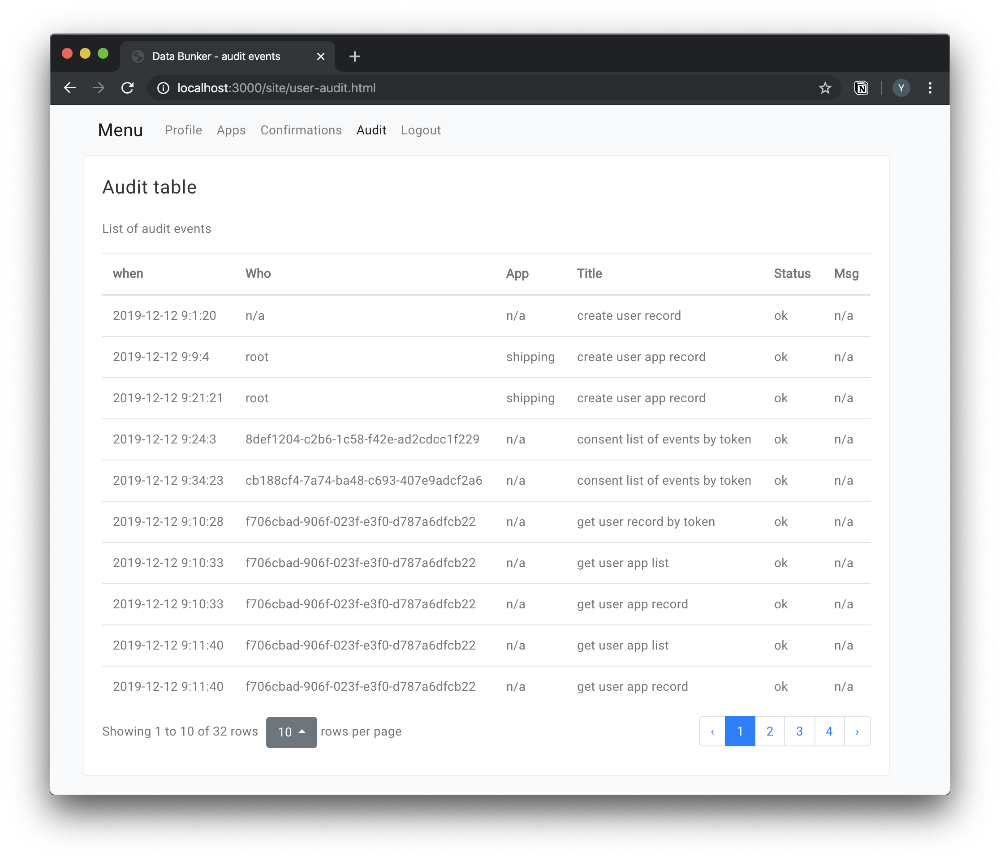
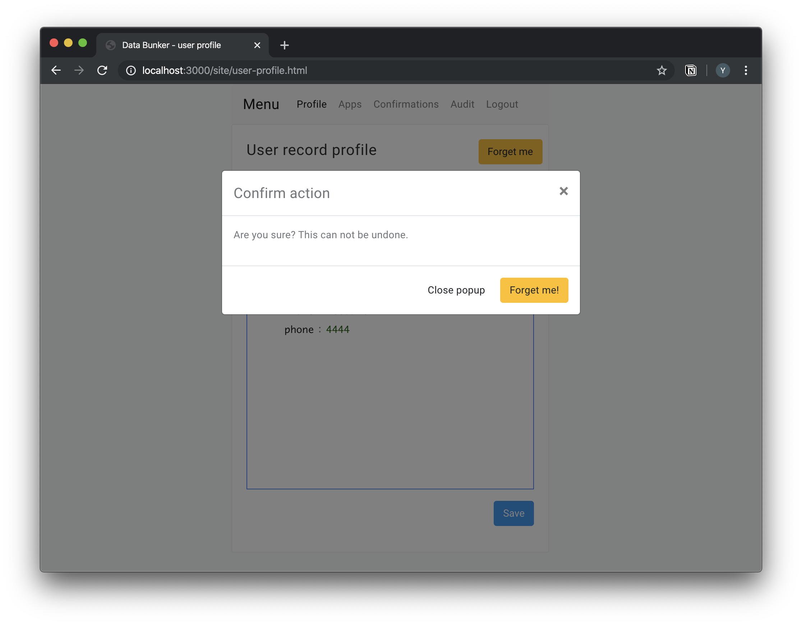

# Databunker

**Databunker is a network-based, self-hosted, GDPR compliant, secure database for personal data or PII: https://databunker.org/**

<div align="center">
 <p>
  <a href="https://join.slack.com/t/databunker/shared_invite/zt-b6ukxzw3-JCxv8NJDESL40haM45RNIA"></a>
  <a href="https://github.com/securitybunker/databunker-store"></a>
  <a href="https://github.com/securitybunker/databunker-session-store"></a>
 </p>
</div>

Project **demo** is available at: [https://demo.databunker.org/](https://demo.databunker.org/). Please add a **star** if you like our project.

We live in a world where the privacy of our information is nonexistent. The EU has been working to remediate this fallacy with GDPR, and the US (California) follows with a first sparrow called CCPA.

Databunker Project is intended to ease the acceptance of GDPR and CCPA. It gives organizations an easy-to-implement API's, secure Database to store PII, and privacy portal.

Databunker gives all of us, the real data owners, control of our data. Databunker allows us to know who is using our data, what is happening with our personal data and gives us the freedom to decide if we agree to that or not.

Databunker, when deployed correctly, replaces all the customer's personal records (PII) scattered in the organization's different
internal databases and log files with a single randomly generated token managed by the Databunker service.

By deploying this project and moving all personal information to one place, you will comply with the following
GDPR statement: *Personal data should be processed in a manner that ensures appropriate security and 
confidentiality of the  personal data, including for preventing unauthorized access to or use of personal
data and the equipment used for the processing.*

#### Diagram of old-style solution.



#### Diagram of Solution with Databunker


Other documents: [INSTALLATION](INSTALLATION.md)

## Demo

Project demo is available at: [https://demo.databunker.org/](https://demo.databunker.org/)

You can see management for **Natural person** (**data subject**) account access:

```
Phone: 4444
Code: 4444
```

```
Email: test@securitybunker.io
Code: 4444
```

Demo Admin access token: ```DEMO```

---

## Node.js Examples

1. Node.js example implementing passwordless login using Databunker:
https://github.com/securitybunker/databunker-nodejs-passwordless-login

2. Node.js example with Passport.js, Magic.Link and Databunker:
https://github.com/securitybunker/databunker-nodejs-example

3. Secure Session Storage for Node.js apps:
https://databunker.org/use-case/secure-session-storage/#databunker-support-for-nodejs

## Node.JS modules

1. `@databunker/store` from https://github.com/securitybunker/databunker-store

2. `@databunker/session-store` from https://github.com/securitybunker/databunker-session-store

## Databunker benchmark results:

https://databunker.org/doc/benchmark/


## Production deployments

* Backend at https://privacybunker.io/
* Backend at https://bitbaza.io/

Send us a note if you are running Databunker in production.


# This project resolves most** of the GDPR requirements for you including:

**NOTE**: Implementing this project does not make you fully compliant with GDPR requirements and you still
need to consult with an attorney specializing in privacy.

**NOTE**: When we use the term "Customer" we mean the data of the end-user that his information is being stored, shared, and deleted.

## Right of access

Databunker extracts **customer email**, **customer phone** values out of the customers' personal records. It gives your customer **passwordless** access to his data stored under his account. This is done by generating a random access key send by email or by SMS. Your customer can sign in into Databunker, view information stored by Databunker, and make changes in compliance with a company's policy.


<p float="middle">
  
   
  
</p>

## Right to restrict processing / Consent withdrawal

Databunker can manage all of the customer's consents and agreements in one place. Your customer can **withdraw consent** and as a result **restrict processing** in his personal portal at Databunker. For example, your customer can block newsletter service. Your backend system can use Databunker as a collection of all agreements collected using the Databunker API.




**NOTE**: Data bunker can call your backend script on a consent withdrawal (callback). You will have to handle these requests and remove
the customer records from other 3rd party processing companies. For example web recording services, email gateways, etc...

## Privacy by design

This product, from the architecture level and down to code was built to comply with strict privacy laws such as GDPR and CCPA. Deploying this project can make your architecture **privacy by design** compliant. For more info, check out the following article:

https://databunker.org/use-case/privacy-by-design-default/


## Transparency and Accountability principle

Any system or customer connecting to Databunker must provide an **access token** to authorize any operation, otherwise, the operation will be aborted. An end customer can login to his profile with a random authorization code sent by email or SMS.

All operations with personal records are **saved in the audit log**.

Any customer can log in to his account at Data Bunker and view the **full audit of activities** performed on his profile.



## Right to be forgotten / Right to erasure

When your customer requests to exercise his **right to be forgotten**, his private records will be wiped out of the Data Bunker database, giving you the possibility to leave all internal databases intact while not impacting any of your other systems.

Upon customer removal request, Data bunker can call your backend script (callback) with the customer details. You will have to handle these requests and remove other customer records from 3rd party processing companies. For example from web recording services, email gateways, etc...



**NOTE**: You will need to make sure that you do not have any customer identifiable information (PII) in your other databases,
logs, files, etc...

## Right to rectification/ Data Accuracy

Your customer can sign in to his personal account at Databunker and change his records, for example, **change his name**.
Databunker can fire a callback operation with customer's details when a customer operation takes place.


## Right to data portability

Your customer can sign in to his personal account at Databunker and view and **extract all his records stored at Databunker.**

**NOTE**: You will need to provide your customers with a way to extract data from other internal databases.


## Integrity and confidentiality

**All personal data is encrypted**. An audit log is written for all operations with personal records.
Any request using Databunker API is done with **HTTPS SSL certificate**. The enterprise version supports Shamir's Secret Sharing
algorithm to split the master key into a number of keys. A number of keys (that can be saved in different hands in the
organization) are required to bring the system up.


## NOTE

**Implementing this project does not make you fully compliant with GDPR requirements and you still need to
consult with an attorney specializing in privacy.**

---

# Databunker use cases

Detailed information can be found at https://databunker.org/use-case/

* Personal information tokenization and storage https://databunker.org/use-case/customer-profile-storage-tokenization/
* Pseudonymized user identity for cross-border information transfer https://databunker.org/use-case/schrems-ii-compliance/
* Critical data segregation https://databunker.org/use-case/critical-data-segregation/
* Personal Data minimization https://databunker.org/use-case/data-minimization/
* Trace customer profile changes and access https://databunker.org/use-case/trace-profile-access-change/
* Temporary customer/app/session identity for 3rd party services https://databunker.org/use-case/temporary-record-identity/
* Encrypted session storage https://databunker.org/use-case/secure-session-storage/
* GDPR compliant logging https://databunker.org/use-case/gdpr-compliant-logging/ 
* User privacy portal https://databunker.org/use-case/user-privacy-controls/
* Consent management, i.e. withdrawal
* Passport.js support
* DPO friendly service
 
---

# Blog posts, articles, or other resources that talk about Databunker:

1. https://dbweekly.com/issues/348
2. https://www.freecodecamp.org/news/how-to-stay-gdpr-compliant-with-access-logs/
3. https://databunker.org/
4. https://news.ycombinator.com/item?id=26690279
5. https://stackshare.io/databunker
6. https://hackernoon.com/data-leak-prevention-with-databunker-xnn33u9
7. https://anchor.fm/techandmain/episodes/Huawei--Microsoft-and-DataBunker--Yuli-Stremovsky-evl385
8. https://github.com/expressjs/session

If you published an article about Databunker send us a link at yuli@privacybunker.io

---

# Databunker quick start guide

Follow this [article](https://databunker.org/doc/start/).

---

# Contact us

If you have any questions, you can contact me at yuli@privacybunker.io

Join the project slack channel to talk with developers: [https://databunker.slack.com/](https://join.slack.com/t/databunker/shared_invite/zt-b6ukxzw3-JCxv8NJDESL40haM45RNIA)
